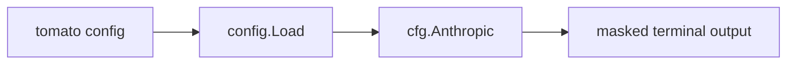

# Architecture

## 1. System Overview
Change only the CLI presentation layer for `tomato config`. No config schema changes.

## 2. Components and Responsibilities
- `cmd/commands.go`: owns the `tomato config` command output.
- Existing `config.Config.Anthropic`: source of Anthropic settings.

## 3. Data Flow

## 4. Interfaces and Contracts
No public API changes.

## 5. Persistence / Files / State
Reads `tomato.yaml`. No writes.

## 6. Error Handling Strategy
If config fails to load, preserve existing error behavior.

## 7. Security and Privacy Considerations
Never print full `auth_token`. Mask to first 8 chars + `...`.

## 8. Testing Strategy
Add cmd test that writes a temporary tomato.yaml, runs `tomato config`, and asserts:
- Anthropic section exists.
- masked token appears.
- full token does not appear.

## 9. Tradeoffs and Alternatives Considered
Could hide token entirely, but showing a short prefix helps users confirm which token is loaded.
