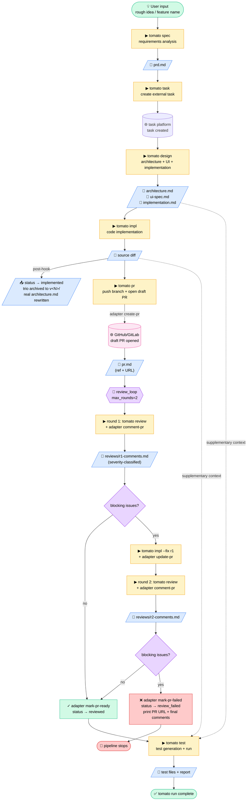
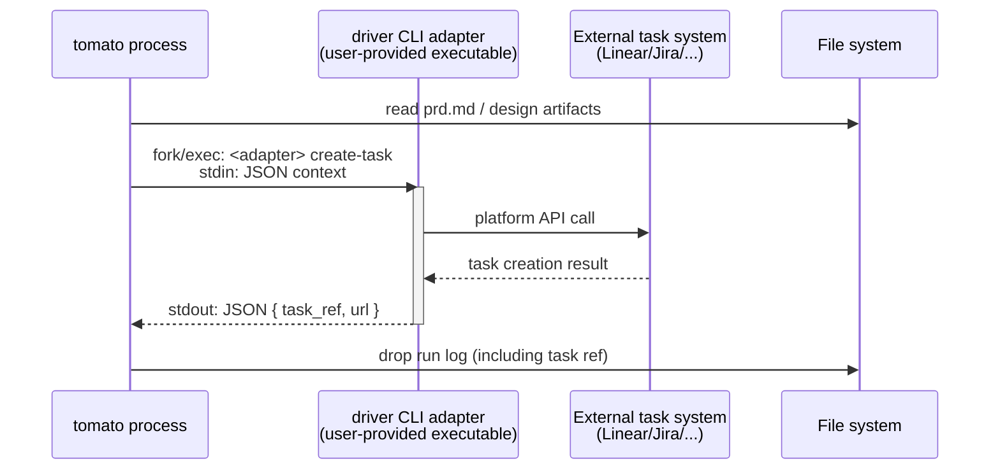
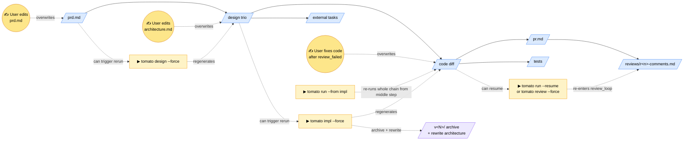
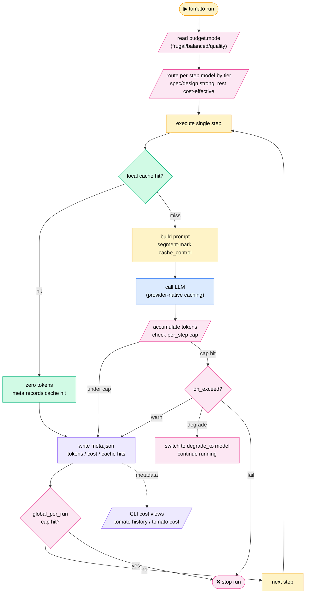
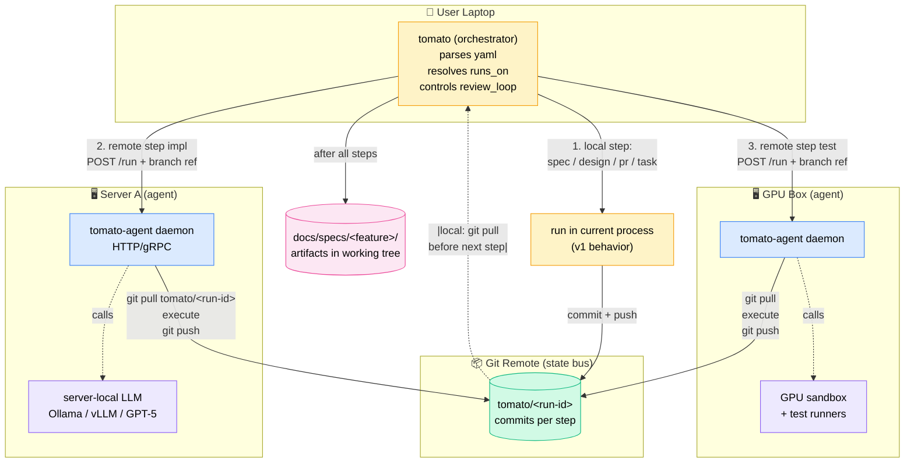
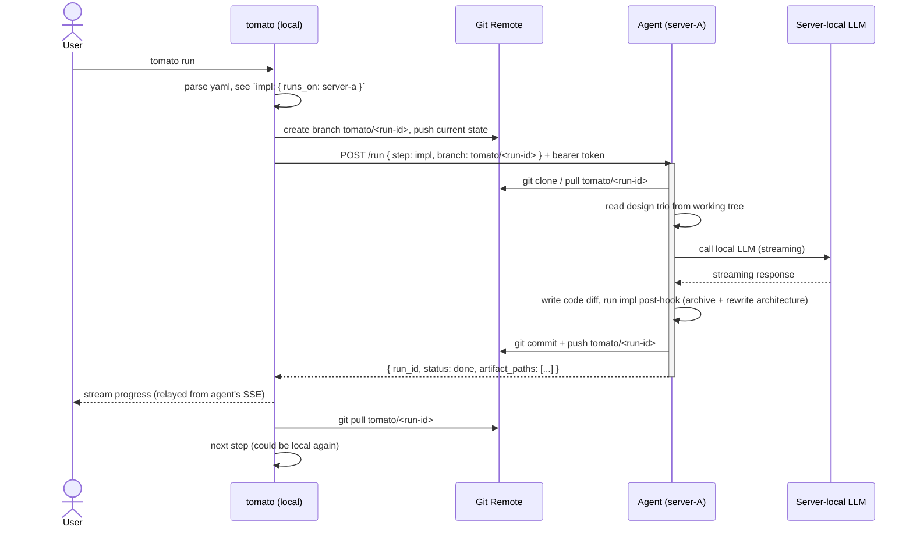

# Tomato Default Development Workflow Diagrams

- **Date**: 2026-06-18
- **Status**: Draft
- **Companion document**: [2026-06-18-tomato-vision-design.md](./2026-06-18-tomato-vision-design.md)
- **Type**: Diagram collection for the Vision document

> This file visually presents the default workflow described in §2 of the vision document using Mermaid diagrams. All diagrams are consistent with the vision document; in case of conflict, the vision document prevails.

---

## Diagram 1 · Default Development Workflow Main Diagram (`tomato run` full process)

`tomato run` is equivalent to `tomato run default`, executing the 7 built-in steps in order: `spec → task → design → impl → pr → review_loop → test`. The `task` step runs early so subsequent step post-hooks can update the external task status. The `review_loop` is the only built-in meta-step (control-flow primitive), allowing up to 2 fix iterations before failing the pipeline.



### Reading notes

- **Solid thick arrows** = default sequential flow
- **Dashed "supplementary context"** = the step also reads upstream artifacts when executing (not a trigger relationship)
- **Colors**:
  - 🟡 Yellow = CLI commands
  - 🔵 Blue = git-tracked artifacts (in `docs/`)
  - 🟣 Pink = external systems (PRs / task platforms)
  - 🟢 Green = flow start / end points
  - 🟪 Purple = `review_loop` meta-step control flow
  - 🔴 Red = failure path

### Dependency summary between steps

| Step | Main input | Supplementary context | Main artifact | post-hook |
|------|--------|------------|--------|------------|
| spec | User's rough idea | — | `prd.md` | status → `specified` |
| task | `prd.md` | — | external task created (`task.json`) | enables later status post-hooks |
| design | `prd.md` | — | `architecture.md` / `ui-spec.md` / `implementation.md` | status → `designed` |
| impl | design trio | — | source diff | status → `implemented`; trio archived to `v<N>/`; real `architecture.md` rewritten |
| pr | git working tree | — | `pr.md` (PR ref + URL) | status → `pr_opened` (draft) |
| review_loop | source diff + `pr.md` | — | `reviews/r<n>-comments.md`, PR comments posted | status → `reviewed` (pass) OR `review_failed` (pipeline stops) |
| test | source diff | design trio | test files + report | status → `tested` |

---

## Diagram 2 · Single-Step Internal Interaction

Each step at runtime involves three parties: user terminal, tomato CLI (single short-lived process), LLM provider. The `task` step additionally invokes the user-provided driver CLI adapter via subprocess.

### 2.1 General Step (using `tomato design` as example)

```mermaid
sequenceDiagram
    actor U as User terminal
    participant T as tomato process<br/>(short-lived)
    participant L as LLM Provider<br/>(routed per yaml)
    participant FS as File system

    U->>T: tomato design
    T->>FS: read tomato.yaml + docs/specs/<feature>/prd.md
    FS-->>T: config + PRD content
    T->>T: render prompt template<br/>(architecture + UI + implementation — 3 segments)
    T->>L: call LLM (streaming)
    L-->>T: streaming response
    T-->>U: stream tokens to stdout in real time
    T->>FS: write architecture.md
    T->>FS: write ui-spec.md
    T->>FS: write implementation.md
    T->>FS: drop .tomato/runs/&lt;id&gt;/ run log
    T-->>U: completion notice + run-id
    Note over U: inspect later via<br/>tomato history show <run-id>
```

### 2.2 Extra step for `task` (driver CLI adapter)



For detailed adapter protocol specs, see vision document §3.3.

---

## Diagram 3 · Iteration / Re-run Model

`tomato run` is not a one-shot pipeline — all artifacts are in git, so **at any point you can hand-edit any artifact and then re-run from any middle step**; downstream regenerates based on the new artifact.



### Core promises

Every artifact is markdown / text, fully tracked by git, so these are all first-class operations:

- ✏️ AI made a mistake → hand-edit the artifact
- 🔄 Want to regenerate downstream → run `tomato <step> --force` or `tomato run --from <step>`
- ⏪ Roll back an experiment → just git-revert, no context lost
- 🔍 Debug why the LLM wrote it this way → look at `.tomato/runs/<id>/prompts.jsonl`
- 📦 Auto-archive old design after impl → `docs/specs/<feature>/v<N>/` preserves full history
- 🏗️ Architecture doc is always the truth → `architecture.md` reflects the real code structure after the most recent impl

---

## Mapping to vision document

| This file's section | Vision document section |
|------------|---------------------|
| Diagram 1 main flow | §2.1 seven built-in steps, §2.2 default workflow, §2.6 data flow |
| Diagram 1 post-hook | §2.1 step status lifecycle, §2.8 architecture versioning & rewrite |
| Diagram 1 `review_loop` subgraph | §2.10 review loop (max_rounds / severity / on_fail) |
| Diagram 1 `pr` step + adapter calls | §2.1 `pr` step, §3.3 driver CLI protocol (create-pr / update-pr / comment-pr / mark-pr-*) |
| Diagram 2.1 general single-step | §3.1 process model, §3.2 core components, §2.7 run logs |
| Diagram 2.2 task step | §3.3 driver CLI protocol |
| Diagram 3 iteration re-run | §2.1 step idempotency, §2.6 artifacts as interfaces, §2.8 architecture versioning, §2.10 review_loop recovery |

---

## Diagram 4 · Token & Budget Control Flow

tomato controls tokens at three levels: **saving (caching + tiered routing), visibility (meta + CLI), caps (budget + on-exceed strategy)**.



### Reading notes

- **Green** = cache path (zero or low tokens)
- **Blue** = actual LLM call (via provider-native caching)
- **Pink** = budget control points (per_step and global two-level checks)
- **Purple** = cost visibility (meta + CLI subcommands)
- **Three presets** are read at run start, determining which model each step uses
- **Two-level caps**: per-step budget hit → `on_exceed` strategy; global budget hit → stop directly

### Key savings points

| Means | When effective | Savings magnitude |
|------|----------|----------|
| Provider-native prompt caching | Every actual LLM call | Input tokens ~10x |
| Local response cache | Same input re-run (common in iteration scenarios) | 100% (zero calls) |
| Tiered model routing | Per-step independent model selection | strong model for design, cheap for the rest |
| Toggleable optional items | User proactively turns off non-essential calls | Each saves one full call |

### Mapping to vision document (supplementary)

| This file's section | Vision document section |
|------------|---------------------|
| Diagram 4 token control flow | §2.9 Token & Budget Control |
| Diagram 5 distributed execution (v2 design) | §5 Distributed Execution |

---

## Diagram 5 · Distributed Execution (v2 Ahead-of-Time Design)

> ⚠️ **NOT implemented in v1.** This diagram visualizes the v2 target topology described in vision §5. v1's `runs_on:` field is reserved syntax accepting only `local`; agents and remote dispatch are not built. This diagram exists so that v1 design decisions can be validated against the v2 target.



### Reading notes

- 🟡 Yellow = local execution (v1 behavior unchanged)
- 🔵 Blue = remote agent daemons (v2 only)
- 🟢 Green = git as the single state bus
- 🟪 Purple = LLM instances reachable only from a specific agent
- 🟣 Pink = final artifacts in the user's working tree

### Sequence: one remote step end-to-end (v2)



### v1 → v2 invariants preserved

| v1 design choice | Why it stays correct under v2 |
|------------------|------------------------------|
| Steps communicate via files in `docs/specs/<feature>/` | Files travel via git — no change to step internals |
| `tomato.yaml` is source of truth | Same yaml runs locally or distributed; only `runs_on:` changes |
| Per-run logs in `.tomato/runs/<id>/` | Agent's run logs stay agent-side; local just stores its own |
| Control flow (review_loop, archiving, post-hooks) is in the orchestrator | Never delegated to agents — agents stay stateless and replaceable |
| Adapters are separate executables | Installed per-agent; no protocol change needed |

### Failure modes (v2 baseline)

| Failure | v2 behavior |
|---------|-------------|
| Agent unreachable | Step fails immediately, agent URL printed, pipeline stops |
| Agent OOM mid-step | Partial state visible on branch; user manually fixes + `tomato run --resume` |
| Git push conflict | Step fails; user resolves; resume |
| Local Ctrl+C | Local stops dispatching; in-flight remote step continues to completion |
| Auth token rejected | Step fails at submission; config error |

**No auto-retry, no failover, no health-based load balancing in v2.** Those are v3+ if at all.
